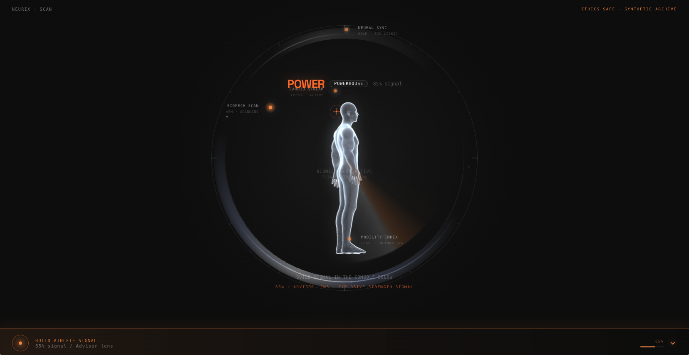
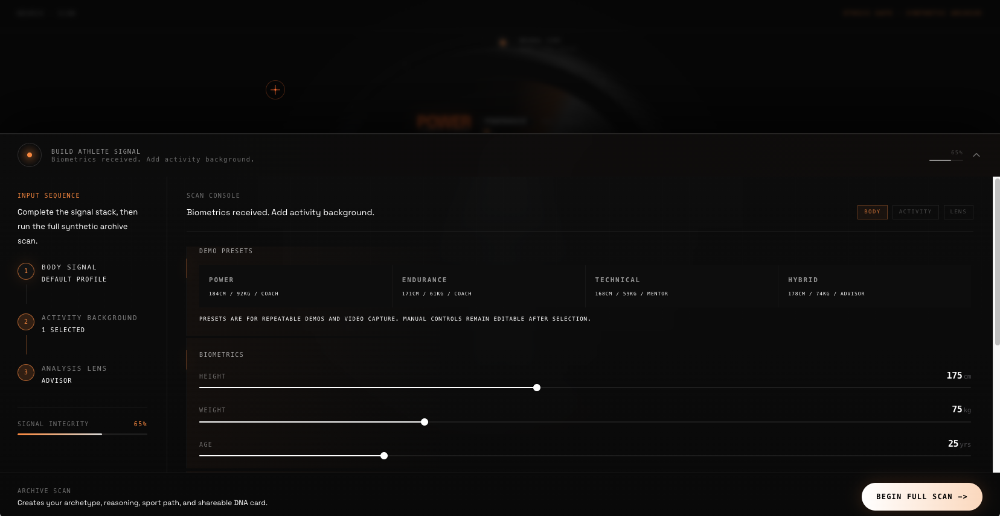
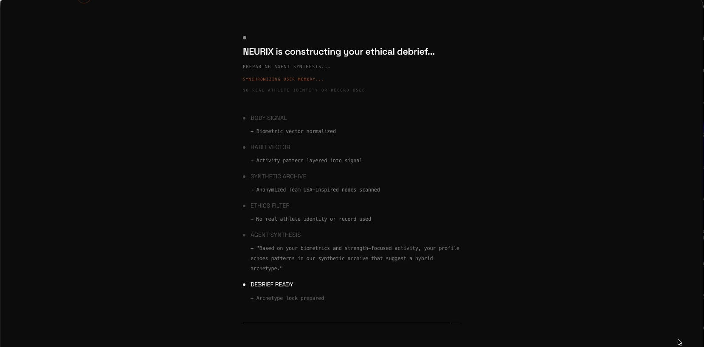
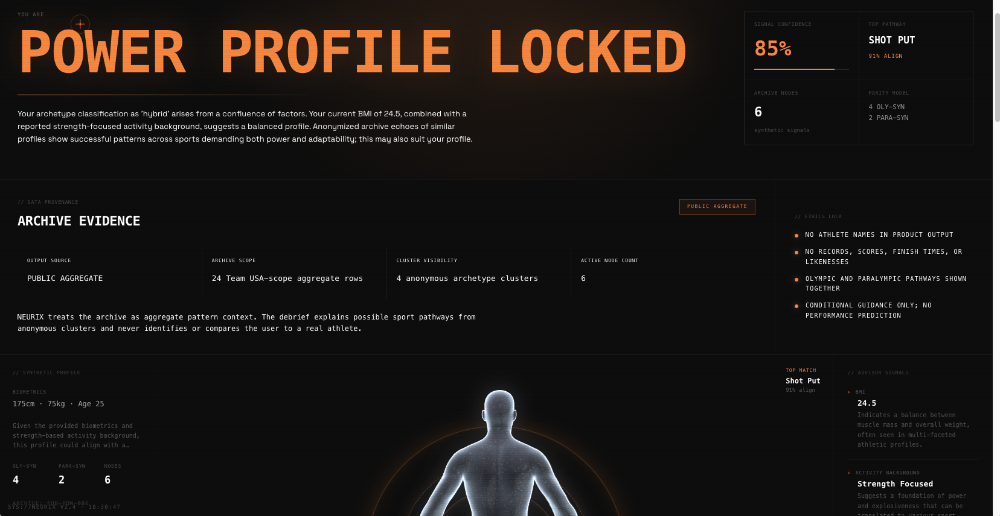
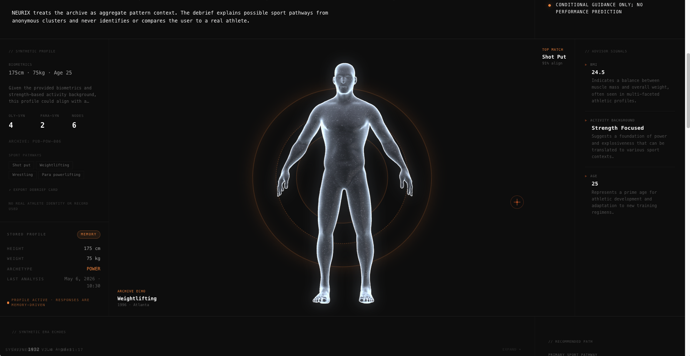
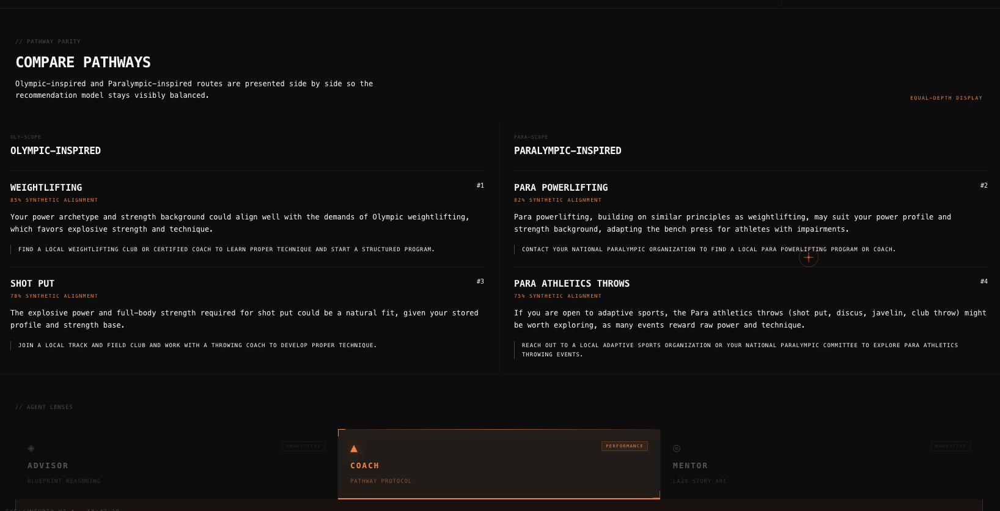
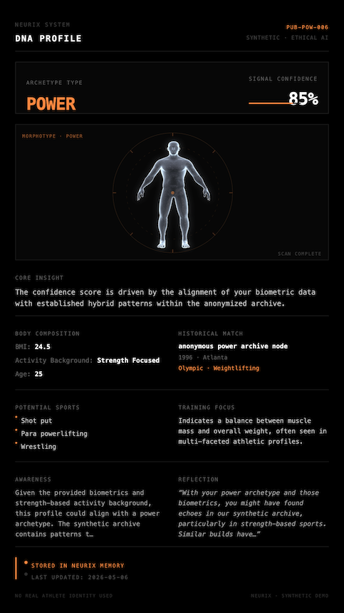
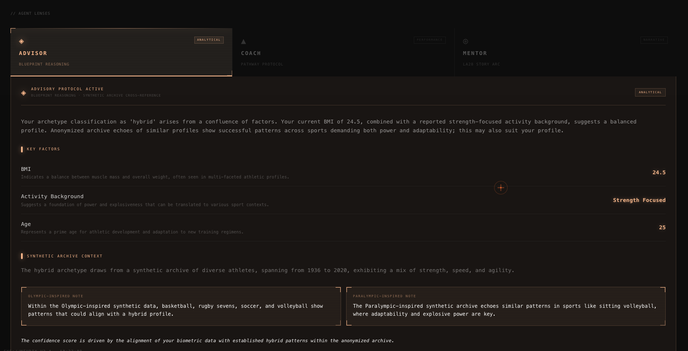
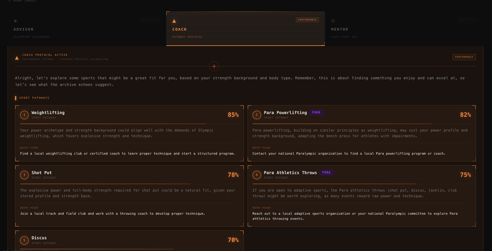

# NEURIX — Ethical Athlete Archetype Agent

> A fan-facing Digital Mirror that turns biometric signals into anonymous Team USA-inspired athlete archetypes, sport pathways, and shareable AI debriefs.

NEURIX is built for **Challenge 4 — The Athlete Archetype Agent**. It helps a fan ask a simple, emotional question:

**"Where could my body and habits belong in the wider story of sport?"**

The answer is intentionally careful. NEURIX does not predict Olympic performance, identify real athletes, use athlete likenesses, or claim real one-to-one matching. Instead, it combines anonymous aggregate archive logic, Gemini reasoning, and a strong ethics layer to produce conditional, inclusive, fan-centered sport exploration.

---

## Why It Exists

Team USA history is powerful, but most fans experience it from the outside: medals, records, broadcasts, and highlights. NEURIX makes that history feel personal without crossing privacy or NIL boundaries.

The product reframes athlete data as **anonymous pattern context**:

- A fan enters height, weight, age, activity background, and an optional voice prompt.
- NEURIX reads those inputs as a body-and-habit signal.
- Gemini explains which anonymous archetype the signal could align with.
- Olympic-inspired and Paralympic-inspired pathways are shown with equal depth.
- The user receives a shareable **NEURIX DNA Profile Card** that feels personal, but never claims destiny.

The goal is not talent identification. The goal is ethical imagination.

---

## Live Demo

- **Main app:** https://neurix-1012984487516.us-east1.run.app
- **Quick judging flow:** https://neurix-1012984487516.us-east1.run.app/scan?demo=hybrid&lens=mentor

The quick demo URL opens the scan console with a repeatable hybrid preset and Mentor lens selected. Click **Begin Full Scan** to run the analysis flow and reveal the results debrief.

---

## Product Demo Flow

```plaintext
┌──────────────────────┐
│  1. Scan Console      │
│  biometrics + habits  │
└──────────┬───────────┘
           │
           ▼
┌──────────────────────┐
│  2. Signal Preview    │
│  local classifier     │
└──────────┬───────────┘
           │
           ▼
┌──────────────────────┐
│  3. Gemini Analysis   │
│  archetype + agents   │
└──────────┬───────────┘
           │
           ▼
┌──────────────────────┐
│  4. Results Debrief   │
│  provenance + parity  │
└──────────┬───────────┘
           │
           ▼
┌──────────────────────┐
│  5. DNA Card Export   │
│  shareable artifact   │
└──────────────────────┘
```

### Main User Journey

1. Open the scan console.
2. Choose a demo preset or manually enter biometrics.
3. Select activity background and an agent lens.
4. Run the full scan.
5. Watch the analysis pipeline construct the debrief.
6. Review the archetype, archive evidence, parity comparison, agent lenses, and DNA card.

---

## Screenshots

Screenshots for review and deployment are checked in under `docs/screenshots/`.

| Screen | Purpose | Preview |
|---|---|---|
| Scan Console | Body signal input and HUD layout |  |
| Scan Details | Signal controls and active scan state |  |
| Thinking Pipeline | Real-time analysis stages |  |
| Results Hero | Archetype lock and primary narrative |  |
| Provenance Panel | Data and ethics evidence for judges |  |
| Pathway Comparison | Olympic and Paralympic parity |  |
| DNA Card | Shareable final artifact |  |
| Advisor Mode | Analytical agent lens |  |
| Coach Mode | Training and pathway agent lens |  |

---

## Challenge Alignment

NEURIX targets the Athlete Archetype Agent challenge by focusing on four judging-critical areas:

### 1. Gemini 3 Flash-Powered Archetype Reasoning

Gemini 3 Flash Preview (`gemini-3-flash-preview`) is used for:

- Archetype explanation
- Advisor, Coach, and Mentor narrative modes
- Sport pathway reasoning
- Reflection generation
- Voice transcript parsing

The Gemini layer is structured by explicit JSON contracts in `core/prompts.ts`, with strict rules for conditional language, anonymous archive references, and Olympic/Paralympic parity.

### 2. Anonymous Team USA-Scope Archive Logic

NEURIX includes a reproducible public aggregate archive pipeline:

```plaintext
data/raw/*.csv
   ↓
scripts/build-public-archive.mjs
   ↓
data/processed/team-usa-archetype-clusters.json
   ↓
core/publicArchive.ts
   ↓
Gemini prompt context + results provenance
```

The checked-in sample CSV is anonymous and balanced across archetypes so judges can inspect the end-to-end pipeline without private or identifiable athlete data.

### 3. Olympic and Paralympic Parity

The interface does not hide Paralympic pathways in a secondary note. NEURIX presents them as first-class outputs:

- Equal-depth sport recommendations
- Dedicated pathway comparison section
- Parity counts in the archetype panel
- Prompt rules that require Paralympic representation
- Synthetic fallback data with matched Olympic/Paralympic signal counts

### 4. Ethics and NIL Safety

NEURIX explicitly avoids:

- Real athlete names in product output
- Athlete likenesses, photos, or videos
- Finish times, scores, medal results, or exact records
- Claims of real athlete matching
- Guaranteed performance predictions

Every result is framed as conditional exploration: **could align**, **may suit**, **synthetic patterns suggest**, **anonymous archive echoes**.

---

## Core Features

### Scan Console

The scan page lets users build a body signal through biometrics, habits, voice input, and agent mode selection. It includes demo presets for reliable judging and video capture.

Demo URLs:

```plaintext
/scan?demo=power
/scan?demo=endurance
/scan?demo=technical
/scan?demo=hybrid
```

Optional agent lens:

```plaintext
/scan?demo=hybrid&lens=mentor
/scan?demo=endurance&lens=coach
```

### Real-Time Thinking Pipeline

The thinking page streams analysis states from `/api/analyze`, so the experience feels like a system constructing a debrief rather than a static form response.

Pipeline events include:

- Archetype lock
- Advisor synthesis
- Insight peek
- Soul twin archive echoes
- Reflection generation
- Optional Coach or Mentor preload

### Results Debrief

The results page is the main judging surface. It includes:

- Archetype reveal
- Signal confidence
- Archive node counts
- Data Provenance / Ethics panel
- 3D Spline body visualization
- Key factors
- Reflection
- Recommended sport pathway
- Olympic vs. Paralympic comparison
- Advisor / Coach / Mentor agent lenses
- Synthetic archive echoes

### Data Provenance / Ethics Panel

This panel makes the data story visible:

- Whether the result is using public aggregate context or synthetic fallback
- Number of Team USA-scope aggregate rows
- Number of anonymous archetype clusters
- Active node count
- Ethics lock checklist

This is designed to help judges immediately understand that the project is not making unsafe athlete identity claims.

### Pathway Comparison

The pathway comparison section shows Olympic-inspired and Paralympic-inspired recommendations side by side. This keeps parity visible in the UI, not only hidden in prompts or backend logic.

### Agent Lenses

NEURIX includes three interpretation modes:

- **Advisor** — analytical explanation of why the archetype was assigned
- **Coach** — practical sport pathways and training phases
- **Mentor** — long-term story arc toward LA28 as a narrative horizon

### DNA Profile Card

The DNA card is a shareable export artifact. It summarizes:

- Archetype
- Signal confidence
- Core insight
- Body composition factors
- Archive echo
- Potential sports
- Training focus
- Reflection
- Ethics stamp

---

## System Architecture

```plaintext
                         ┌────────────────────────────┐
                         │        Next.js UI           │
                         │ scan / thinking / results   │
                         └──────────────┬─────────────┘
                                        │
                    ┌───────────────────┼───────────────────┐
                    │                   │                   │
                    ▼                   ▼                   ▼
          ┌─────────────────┐  ┌─────────────────┐  ┌─────────────────┐
          │ Local Classifier │  │ Zustand Memory  │  │ 3D / DNA Export │
          │ BMI + habits     │  │ persisted state │  │ Spline + card   │
          └────────┬────────┘  └────────┬────────┘  └─────────────────┘
                   │                    │
                   └──────────┬─────────┘
                              ▼
                    ┌─────────────────────┐
                    │    API Routes        │
                    │ analyze / agent mode │
                    └──────────┬──────────┘
                               │
          ┌────────────────────┼────────────────────┐
          │                    │                    │
          ▼                    ▼                    ▼
┌───────────────────┐ ┌───────────────────┐ ┌────────────────────┐
│ Public Archive     │ │ Gemini Prompting   │ │ Synthetic Fallback  │
│ aggregate clusters │ │ structured JSON    │ │ complete demo data  │
└───────────────────┘ └───────────────────┘ └────────────────────┘
```

---

## Data Pipeline

The archive builder reads permitted public CSV files from `data/raw`, filters to US/Team USA-scope rows, and generates anonymous aggregate clusters.

```bash
npm run build:archive
```

Generated output:

```plaintext
data/processed/team-usa-archetype-clusters.json
```

The generated archive contains:

- Schema version
- Source type
- Total input rows
- US-filtered row count
- Privacy metadata
- Anonymous archetype clusters
- Olympic and Paralympic counts
- Aggregate height, weight, and age averages
- Top sport categories
- Top hometown regions

The output never preserves names.

---

## Fallback Strategy

Challenge demos are fragile when they depend on a live model or network conditions. NEURIX is designed to stay presentable:

- If Gemini fails, `/api/analyze` returns complete synthetic debrief data.
- If JSON parsing fails, the app falls back to deterministic archetype data.
- If no public aggregate archive is generated, prompts label the archive context as synthetic fallback.
- The UI continues to show ethics labels and parity counts in fallback mode.

This makes the project reliable without pretending fallback data is real.

---

## Tech Stack

- **Framework:** Next.js 14 App Router
- **Language:** TypeScript
- **UI:** React 18 + Tailwind CSS
- **State:** Zustand with local persistence
- **AI:** Gemini 3 Flash Preview (`gemini-3-flash-preview`) via `@google/generative-ai`
- **3D:** Spline iframe visualization
- **Export:** `html2canvas`
- **Deployment:** Google Cloud Run-ready Dockerfile

---

## Local Setup

```bash
npm install
cp .env.example .env.local
```

Add your Gemini key:

```bash
GEMINI_API_KEY=...
GEMINI_MODEL=gemini-3-flash-preview
```

Keep `GEMINI_API_KEY` server-side only. Do not prefix it with `NEXT_PUBLIC_`, do not import it into client components, and store real values only in `.env.local` locally or deployment secrets in production. `GEMINI_MODEL` defaults to `gemini-3-flash-preview` if omitted.

Run locally:

```bash
npm run dev
```

Open:

```plaintext
http://localhost:3000
```

---

## Quality Checks

```bash
npm run build:archive
npm run lint
npm run build
```

Current verified status:

- Archive build passes
- ESLint passes
- Production build passes

---

## Cloud Run Deployment

The live service is deployed on Google Cloud Run:

```plaintext
https://neurix-1012984487516.us-east1.run.app
```

The repository includes a standalone Next.js config and Dockerfile.

```bash
docker build -t neurix .
docker run -p 3000:3000 --env GEMINI_API_KEY=your_key --env GEMINI_MODEL=gemini-3-flash-preview neurix
```

For Google Cloud Run, provide `GEMINI_API_KEY` as an environment variable or secret and set `GEMINI_MODEL=gemini-3-flash-preview`.

---

## Repository Map

```plaintext
NEURIX/
├── app/
│   ├── api/
│   │   ├── agent-mode/       # Coach and Mentor API route
│   │   ├── analyze/          # Streaming archetype analysis route
│   │   └── voice-parse/      # Voice transcript extraction route
│   ├── onboarding/           # Intro flow
│   ├── results/              # Results page
│   ├── scan/                 # Scan console
│   └── thinking/             # Analysis pipeline page
│
├── components/
│   ├── landing/              # Landing hero and particle field
│   ├── results/              # Debrief, provenance, parity, DNA card
│   ├── scan/                 # Sliders, habits, presets, HUD, voice input
│   ├── thinking/             # Thinking sequence animation
│   ├── three/                # Spline body integration
│   └── ui/                   # Shared primitives
│
├── core/
│   ├── classifier.ts         # Local deterministic archetype preview
│   ├── gemini.ts             # Gemini client and JSON parsing
│   ├── prompts.ts            # Prompt contracts and safety rules
│   ├── publicArchive.ts      # Aggregate archive adapter
│   ├── syntheticArchive.ts   # Synthetic fallback archive
│   └── dnaExport.ts          # DNA card export helper
│
├── data/
│   ├── raw/                  # Public CSV inputs and anonymous sample
│   └── processed/            # Generated aggregate clusters
│
├── scripts/
│   └── build-public-archive.mjs
│
├── store/
│   └── neurixStore.ts         # Zustand state and memory
│
├── types/
│   └── neurix.ts              # Shared app types
│
├── ARCHITECTURE.md
├── PROMPTS.md
├── Dockerfile
└── README.md
```

---

## Important Files

- `core/prompts.ts` — the main AI behavior contract.
- `core/publicArchive.ts` — connects generated aggregate archive data to prompts/results.
- `core/syntheticArchive.ts` — deterministic fallback debriefs.
- `scripts/build-public-archive.mjs` — reproducible CSV-to-cluster pipeline.
- `components/results/DataProvenancePanel.tsx` — data and ethics evidence.
- `components/results/PathwayComparison.tsx` — Olympic/Paralympic parity surface.
- `components/scan/DemoPresets.tsx` — repeatable demo presets.
- `components/results/DNACard.tsx` — shareable final artifact.

---

## Design Principles

NEURIX uses a restrained system interface rather than a marketing page. The visual language is:

- dark, data-dense, and cinematic
- HUD-inspired but not decorative-first
- focused on evidence, parity, and debrief clarity
- built for a short judging walkthrough

The 3D body is the primary visual focus. Everything else supports the idea of an ethical analysis system.

---

## Future Work

- Add a richer public dataset export with more years and sport categories.
- Add a screenshot gallery for the Devpost page.
- Add a short `SUBMISSION.md` with the final video script and judging narrative.
- Add Playwright smoke tests for demo preset flows.
- Add a Cloud Run deployment guide with exact `gcloud` commands.

---

## License

Apache License 2.0.
